<h1 align="center">
    
    <br>
    PyTorch Implementation of MolGAN
    <br>
</h1>

<p align="center">
  <a href="#Usage">Usage</a> •
  <a href="#Exhibition">Exhibition</a> •
  <a href="#Citation">Citation</a> •
  <a href="#Credits">Credits</a> •
  <a href="#Licence">Licence</a>
</p>

<h3 align="center">
Overview
</h3>

<p align="center">
<strong align="center">
This repository contains a PyTorch implementation of MolGAN: An implicit generative model for small molecular graphs 
(https://arxiv.org/abs/1805.11973). 
</strong>
</p>

## Usage
You can either run MolGAN or MolVAE. Please download and preprocess the dataset before training molGAN. 
### Data Download 
Just simply run a bash script. 
You can find such a bash script in the data 
directory. 
If you see warnings or even errors, 
please just don't worry. 

If you wish to use the QM9 dataset, 
you can skip the data downloading and 
directly proceed to data preprocessing. 
```bash
bash download_dataset.sh
```
### Data Preprocessing 
Just run the python script below. 
You will need to comment different different code 
sections in the main function. 
It is too easy to figure out how to do. 
```bash
python sparse_molecular_dataset.py
```
### MolGAN
Simply run the following command to train. 
```bash
python main_gan.py
```
### MolVAE
For your convenience, 
a VAE version is also implemented. 
```bash
python main_vae.py
```
### Testing
You will need to change some arguments 
in ``args.py`` to test the saved model. 
It is too easy and I believe you can figure out 
how to do it. 
### Kind Reminder
If you witness low or even zero validity for 
generated molecules during training, that is 
normal. Please just don't worry. 

## Molecule Generation Exhibition
These results are trained with the QM9 dataset. 
### Pure RL (WGAN-Lambda = 0.0)
<p align="center">
    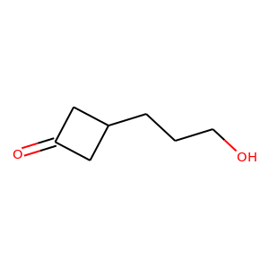
    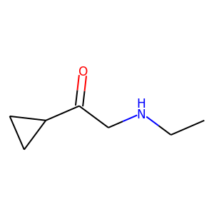
    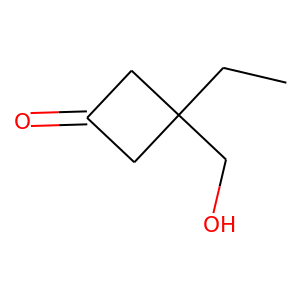
    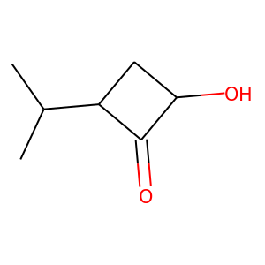
    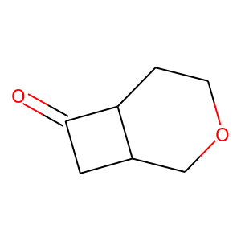
    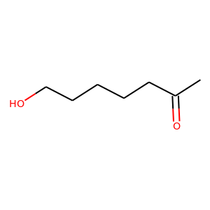
</p>

### Mixture of RL and GAN (WGAN-Lambda = 0.5)
<p align="center">
    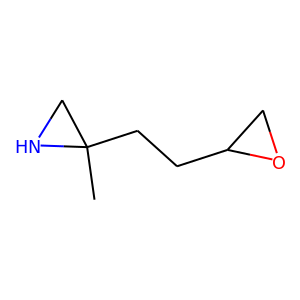
    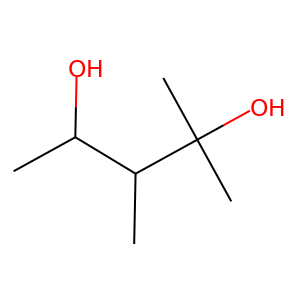
    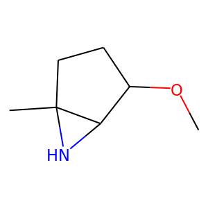
    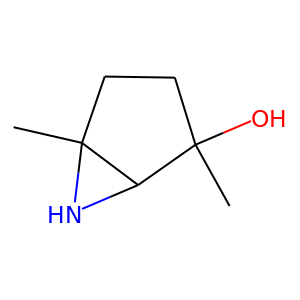
    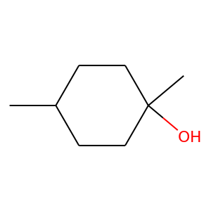
    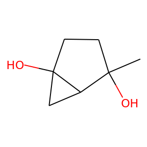
</p>

### Pure GAN (WGAN-Lambda = 1.0)
<p align="center">
    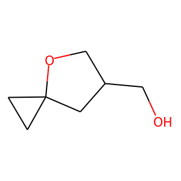
    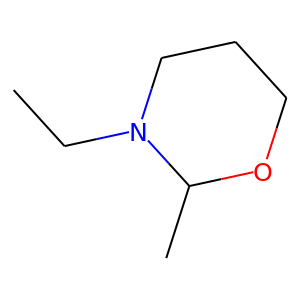
    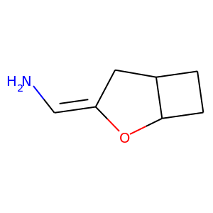
    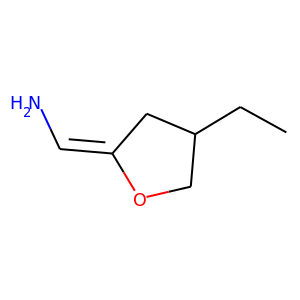
    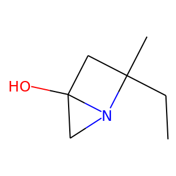
    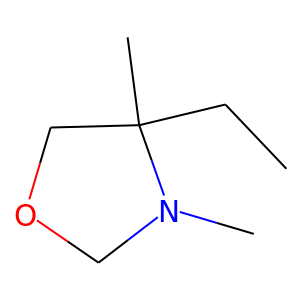
</p>

### MolVAE Reconstruction
<p align="center">
    
    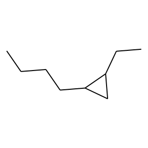
    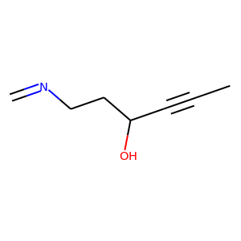
    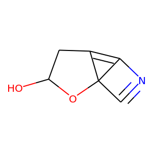
    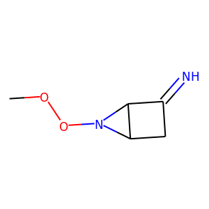
    
</p>

### MolVAE Sampling
<p align="center">
    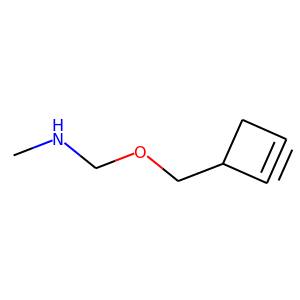
    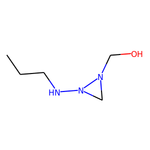
    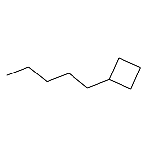
    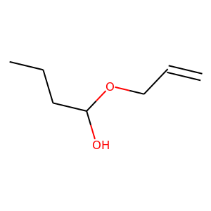
    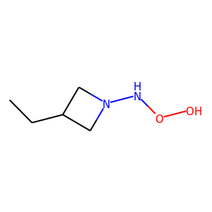
    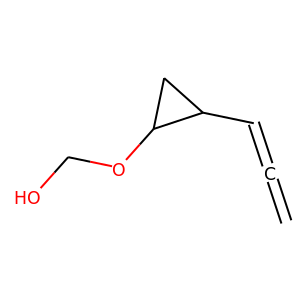
</p>

## Dependencies 
I use PyTorch 1.5. There is no magic for installing 
packages. You can just install all the required 
packages if you run into ``no-such-package`` issues :-) 

## Contacts
If you have any questions regarding this implementation. Please lodge Github issues. 
You can also contact Zhenyue Qin (zhenyue.qin@anu.edu.au). 
I aim to respond emails as soon as I see them :-)  

## Citation
Apart from citing the MolGAN paper, please also consider citing this Github page 
if you find this implementation assists you :-) 
```
@misc{qin2020molgan_pytorch,
  author = {Qin, Zhenyue},
  title = {MolGAN Pytorch Implementaion},
  year = {2020},
  publisher = {GitHub},
  journal = {GitHub repository},
  howpublished = {\url{https://github.com/ZhenyueQin/Implementation-MolGAN-PyTorch}}
}
```

## Credits
This repository uses the following implementations: 
- [MolGAN PyTorch by YongQyu](https://github.com/yongqyu/MolGAN-pytorch)
- [MolGAN TF](https://github.com/nicola-decao/MolGAN)
- [Freeplk](https://www.flaticon.com/free-icon/molecule_2106435?term=molecule&page=1&position=58)

## Licence
[CC-BY-4.0](https://choosealicense.com/licenses/cc-by-4.0/)

